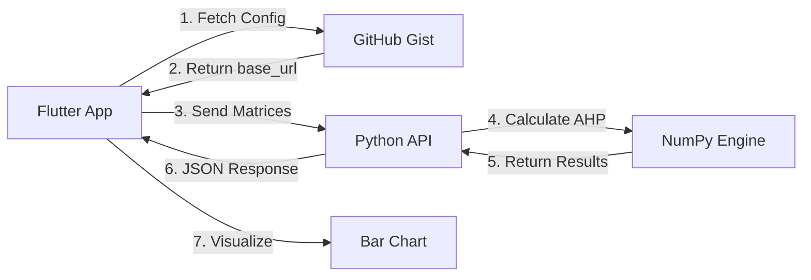

# Agro-AHP Pro 🏭
## Microservices-Based Maintenance Decision System


Sistem Decision Support berbasis **AHP (Analytical Hierarchy Process)** untuk menentukan prioritas maintenance mesin di Pabrik Tepung Tapioka menggunakan arsitektur microservices.

---

## 👨‍💻 Informasi Mahasiswa

| Data | Keterangan |
|------|------------|
| **Nama** | Ardiansyah |
| **NIM** | [Masukkan NIM Anda] |
| **Project** | AHP Engineering (Student Dev Project) |
| **Case Study** | Pabrik Tepung Tapioka |
| **Business Owner** | TIP Holding Company |
| **CTO/BRM** | Junervin |

---

## 📋 Deskripsi Kasus

Departemen Pemeliharaan (Maintenance) di Pabrik Tepung Tapioka milik TIP Holding Company memiliki **anggaran bulanan yang terbatas** dan **tenaga kerja teknisi yang sedikit**. Namun, laporan kerusakan mesin datang bertubi-tubi.

### Permasalahan Utama
Manajer sering mengalami dilema prioritas perbaikan mesin. Saat ini, keputusan diambil berdasarkan "siapa yang teriak paling keras" (subjektif), sehingga sering terjadi:
- ❌ Inefisiensi anggaran
- ❌ Kesalahan prioritas yang berakibat fatal pada target produksi

### Solusi
Sistem **Agro-AHP Pro** menggunakan metode **AHP (Analytical Hierarchy Process)** untuk memberikan keputusan prioritas perbaikan mesin secara **objektif dan matematis** dengan:
- ✅ Consistency Ratio < 0.1 (keputusan konsisten secara matematis)
- ✅ Ranking mesin berdasarkan bobot kepentingan global
- ✅ Justifikasi teknis mengapa mesin A didahulukan dibanding mesin B

### Kriteria Penilaian (Pabrik Tepung Tapioka)
1. **Derajat Putih** - Kualitas output tepung tapioka
2. **Pemakaian Air** - Efisiensi penggunaan air dalam proses
3. **Limbah Padat** - Pengelolaan limbah hasil produksi
4. **Biaya Perbaikan** - Cost effectiveness maintenance

### Alternatif Mesin
1. 🔧 Mesin Pencuci Singkong (Washing Machine)
2. 🔧 Mesin Parut/Rasper (Grating Machine)
3. 🔧 Mesin Ekstraksi Pati (Starch Extraction)
4. 🔧 Mesin Centrifuge (Dewatering Machine)
5. 🔧 Mesin Flash Dryer (Drying Machine)

---

## 🏗️ Arsitektur Sistem



### Komponen Sistem

| Komponen | Teknologi | Fungsi |
|----------|-----------|--------|
| **Backend** | Python Flask + NumPy di Google Colab | AHP Engine / Kalkulator Cerdas |
| **Config Bridge** | GitHub Gist (JSON) | Jembatan alamat server dinamis |
| **Frontend** | Flutter (Dart) | User Interface mobile & web |
| **Tunneling** | Ngrok (Free Tier) | Ekspos localhost ke internet |

---

## 📸 Screenshot Aplikasi

### Swagger UI (Bukti API Berjalan)

*Dokumentasi API endpoint dengan Swagger UI - bukti backend berjalan*

### Aplikasi Flutter

| Halaman | Screenshot | Deskripsi |
|---------|------------|-----------|
| Splash Screen |  | Loading & fetch config dari Gist |
| Setup Kriteria |  | Penjelasan kriteria penilaian |
| Pairwise Comparison |  | Input perbandingan dengan slider 1-9 |
| Result & Ranking |  | Visualisasi bar chart & ranking |

---

## 🔗 Links Penting

| Resource | Link | Status |
|----------|------|--------|
| 📓 **Google Colab** | [Buka Notebook](https://colab.research.google.com/drive/YOUR_COLAB_ID) | 🟢 Viewer Access |
| 📄 **GitHub Gist** | [View Config](https://gist.github.com/YOUR_USERNAME/YOUR_GIST_ID) | 🟢 Public |
| 📱 **Demo APK** | [Download APK](https://github.com/YOUR_USERNAME/YOUR_REPO/releases) | 🟢 Release |
| 🌐 **Live Demo (Web)** | [Open App](https://YOUR_APP.vercel.app) | 🟢 Online |
| 🎬 **Video Demo** | [Watch on YouTube](https://youtube.com/watch?v=YOUR_VIDEO_ID) | 🟢 3-5 menit |

> ⚠️ **PENTING**: Ganti semua link placeholder di atas dengan link asli sebelum submission!

---

## 🚀 Setup Instructions

### Prerequisites
- Python 3.10+ (untuk testing lokal)
- Flutter SDK 3.0+
- Git
- Akun GitHub (untuk Gist)
- Akun Ngrok (Free tier)

### 1️⃣ Backend Setup (Google Colab)

1. **Dapatkan Ngrok Authtoken:**
   - Daftar di [ngrok.com](https://ngrok.com) (gratis)
   - Login dan buka https://dashboard.ngrok.com/get-started/your-authtoken
   - Copy **Authtoken** Anda

2. **Buka Google Colab:**
   - Buka [Google Colab](https://colab.research.google.com)
   - Upload `backend/AHP_Engine.ipynb`

3. **Setup Authtoken:**
   ```python
   from pyngrok import ngrok
   ngrok.set_auth_token("PASTE_YOUR_AUTHTOKEN_HERE")
   ```

4. **Jalankan Notebook:**
   - Klik **Runtime** → **Run all**
   - Copy URL Ngrok yang muncul: `https://xxxx.ngrok-free.app`

### 2️⃣ Config Bridge Setup (GitHub Gist)

1. **Buat Gist Baru:** Buka [gist.github.com](https://gist.github.com)

2. **Isi Gist:**
   - **Filename:** `config.json`
   - **Content:**
   ```json
   {
     "base_url": "https://xxxx.ngrok-free.app"
   }
   ```

3. **Simpan dan Copy Raw URL**

4. **Update Flutter:** Ganti `gistRawUrl` di `frontend/lib/services/config_service.dart`

### 3️⃣ Frontend Setup (Flutter)

```bash
# Install dependencies
cd frontend
flutter pub get

# Run di Chrome (testing)
flutter run -d chrome

# Build APK Release
flutter build apk --release

# Build Web (untuk Vercel)
flutter build web --release
```

---

## � Metode AHP (Analytical Hierarchy Process)

### Hierarki Keputusan
```
Level 1 (Goal)     : Prioritas Perbaikan Mesin
Level 2 (Kriteria) : 4 Kriteria (Derajat Putih, Pemakaian Air, Limbah Padat, Biaya)
Level 3 (Alternatif): 5 Mesin Pabrik Tepung Tapioka
```

### Skala Saaty (1-9)

| Nilai | Keterangan |
|-------|------------|
| 1 | Sama penting |
| 3 | Sedikit lebih penting |
| 5 | Lebih penting |
| 7 | Jauh lebih penting |
| 9 | Mutlak lebih penting |
| 2,4,6,8 | Nilai antara |

### Alur Kalkulasi
1. **Input Matriks Perbandingan Berpasangan** (Skala Saaty 1-9)
2. **Hitung Eigenvector** (Bobot Prioritas)
3. **Hitung Consistency Ratio (CR)**
   - Jika CR > 0.1 → Input harus diulang (tidak konsisten)
   - Jika CR ≤ 0.1 → Input valid dan konsisten
4. **Hitung Global Priority** (bobot kriteria × bobot alternatif)
5. **Generate Ranking** (Rank 1 sampai 5)

---

## 📁 Struktur Project

```
ASPK/
├── backend/
│   ├── AHP_Engine.ipynb          # Google Colab notebook
│   └── colab_ready.py            # Python script siap pakai
├── frontend/
│   ├── lib/
│   │   ├── models/               # Data models
│   │   ├── services/             # API & Config services
│   │   ├── screens/              # UI Screens
│   │   └── main.dart             # Entry point
│   ├── pubspec.yaml
│   └── vercel.json               # Vercel deployment config
├── screenshots/                   # Screenshot bukti
└── README.md                      # Dokumentasi ini
```

---

## 🎯 Fitur Utama

| Fitur | Status |
|-------|--------|
| Algoritma AHP lengkap | ✅ |
| Consistency Check (CR < 0.1) | ✅ |
| Slider interaktif 1-9 | ✅ |
| Visualisasi Bar Chart | ✅ |
| Dynamic API URL via Gist | ✅ |
| Responsive (Mobile & Web) | ✅ |
| Material Design 3 | ✅ |
| Real-time calculation | ✅ |

---

## 🐛 Troubleshooting

| Problem | Solution |
|---------|----------|
| Failed to load config | Pastikan Raw URL Gist sudah benar di `config_service.dart` |
| Failed to calculate | Cek Ngrok masih running, update Gist jika URL berubah |
| CR > 0.1 (tidak konsisten) | Ulangi input perbandingan dengan lebih hati-hati |
| CORS Error | Backend menggunakan `flask-cors`, pastikan sudah terinstall |

---

## 📝 Definitions

| Term | Keterangan |
|------|------------|
| **Pairwise Comparison** | Membandingkan dua elemen untuk menentukan dominan |
| **Skala Saaty** | Skala standar AHP (1-9) |
| **Consistency Ratio (CR)** | Indikator apakah penilaian user konsisten |
| **Ngrok** | Layanan tunneling localhost ke internet |
| **GitHub Gist** | Hosting file teks sederhana dari GitHub |
| **API** | Jembatan komunikasi Flutter ↔ Python |
| **JSON** | Format pertukaran data standar |

---

## 📝 License

MIT License - Free to use for educational purposes

---

## 🙏 Acknowledgments

- **Thomas L. Saaty** - Inventor of AHP Method
- **TIP Holding Company** - Case Study Provider
- **Junervin** - Business Relationship Manager & CTO

---

## 📞 Contact

**Developer:** Ardiansyah  
**NIM:** [Masukkan NIM Anda]  
**Project Type:** Student Development Project  
**Subject:** Sistem Pendukung Keputusan (SPK)

---

**Made with ❤️ for Agro-Industry Decision Support**
